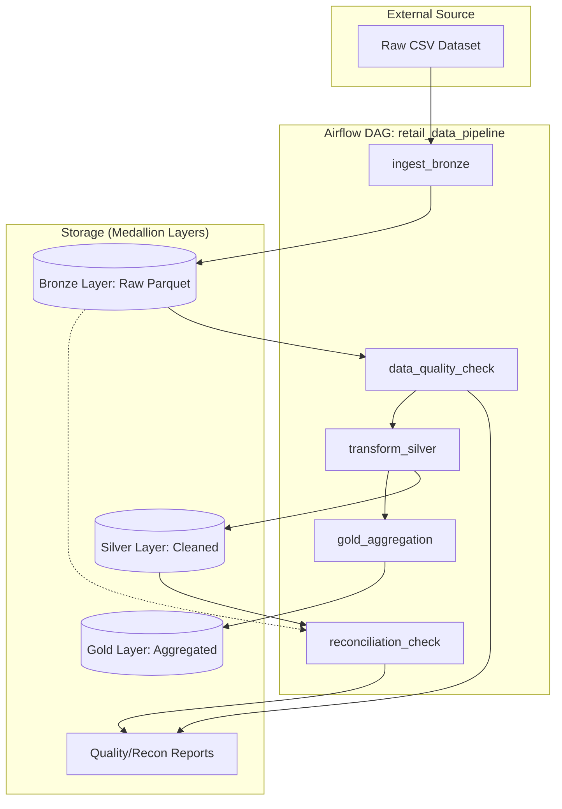

# 🛒 Retail Data Pipeline (Medallion Architecture)

An end-to-end automated data pipeline for retail transaction data. This project demonstrates a production-ready **Medallion Architecture** using **Apache Airflow** for orchestration and **Python/Pandas** for data processing, containerized with **Docker**.

---

## 🏗️ Architecture & Data Flow

The pipeline follows the industry-standard Medallion Architecture, ensuring data quality and traceability at every stage.



### 1. 🥉 Bronze Layer (Raw Ingestion)
- **Source:** `/opt/airflow/data/bronze/Retail_Transactions_Dataset.csv`
- **Process:** `spark_jobs/ingest.py`
- **Logic:**
    - Loads the master CSV file.
    - Parses dates using `dayfirst=True`.
    - Partitions data by the Airflow execution date (`ds`).
- **Storage:** `data/bronze/Date=YYYY-MM-DD/transactions.parquet`

### 2. 🥈 Silver Layer (Cleaned & Anonymized)
- **Process:** `spark_jobs/transform.py`
- **Cleaning Logic:**
    - Deduplication based on the full record.
    - Filtering records where `Total_Items <= 0` or `Total_Cost <= 0`.
- **Security & Privacy:**
    - **PII Anonymization:** `Customer_Name` is hashed using **SHA-256** to ensure data privacy while maintaining linkability.
- **Feature Engineering:**
    - Added `avg_price_per_item` (`Total_Cost / Total_Items`).
- **Storage:** `data/silver/Date=YYYY-MM-DD/transactions_cleaned.parquet`

### 3. 🥇 Gold Layer (Business Insights)
- **Process:** `spark_jobs/gold_aggregation.py`
- **Business Logic:**
    - Aggregates total revenue per product.
    - Columns: `Product`, `Revenue`.
- **Storage:** `data/gold/Date=YYYY-MM-DD/sales_summary.parquet`

---

## 🛡️ Data Governance & Quality Control

We implement two layers of validation to ensure the integrity of our data.

### ✅ Data Quality Checks (`data_quality.py`)
Runs automatically after ingestion to flag issues:
- **Null Checks:** Validates all columns for missing values.
- **Uniqueness:** Ensures `Transaction_ID` is unique.
- **Business Rules:**
    - `Total_Cost` and `Total_Items` must be > 0.
    - `Payment_Method` must be one of: `Cash`, `Credit Card`, `Debit Card`, `UPI`.
- **Reporting:** Generates a CSV report in `data/quality/Date=YYYY-MM-DD/data_quality_report.csv`.

### ⚖️ Reconciliation Check (`reconciliation_check.py`)
Compares the input (Bronze) vs. output (Silver) to track data loss:
- Calculates row count differences.
- Ensures Silver never has more rows than Bronze (prevents duplication bugs).
- Generates `reconciliation_report.csv`.

---

## 🛠️ Technical Stack

- **Orchestration:** Apache Airflow 3.2.1
- **Processing:** Python 3.12 (Pandas, PyArrow, FastParquet)
- **Database:** PostgreSQL 16 (Airflow Metadata)
- **Messaging:** Redis (Celery Broker)
- **Infrastructure:** Docker & Docker Compose

---

## 🚀 Deployment Guide

### 1. Environment Preparation
Ensure your system meets the minimum requirements (4GB RAM, 2 CPUs).

```bash
# Create .env file for Airflow
echo "AIRFLOW_UID=$(id -u)" > .env
```

### 2. Initialization
Run this once to set up the database and default user (`airflow`/`airflow`).
```bash
docker-compose up airflow-init
```

### 3. Execution
Start all services in the background:
```bash
docker-compose up -d
```

### 4. Monitoring
- **Airflow UI:** `http://localhost:8080`
- **Flower (Celery UI):** `http://localhost:5555` (Optional profile)

---

## 📊 Directory Structure Detailed

```text
├── config/              # Airflow configurations (airflow.cfg)
├── dags/                # Directed Acyclic Graphs (DAGs)
├── data/
│   ├── bronze/          # Raw partitions
│   ├── silver/          # Cleaned data
│   ├── gold/            # Final business tables
│   └── quality/         # DQ & Reconciliation reports
├── logs/                # Task execution logs
├── spark_jobs/          # Individual processing scripts
└── tests/               # Unit and integration tests
```

---

## 🔮 Future Roadmap

- [ ] **PySpark Integration:** Swap Pandas for PySpark in `spark_jobs/` to handle TB-scale data.
- [ ] **Delta Lake:** Implement Delta Lake for ACID transactions and time travel.
- [ ] **CI/CD:** GitHub Actions to run tests and auto-deploy DAGs.
- [ ] **Dashboarding:** Connect Gold layer to Superset or Metabase.
